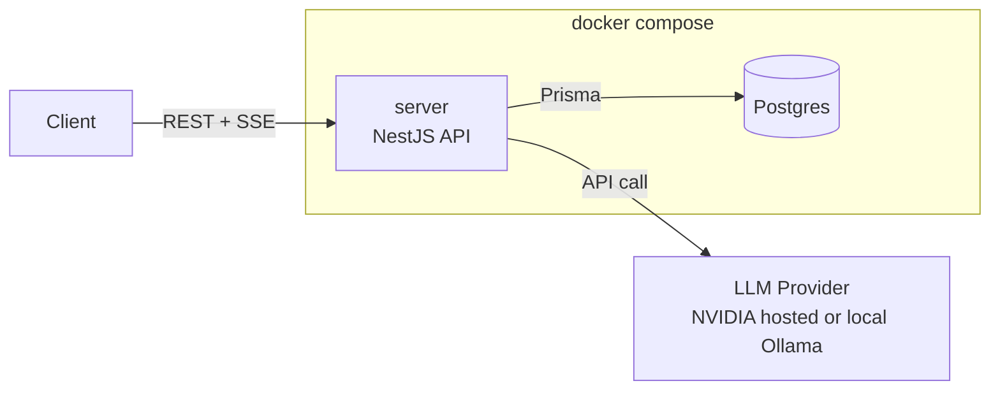

# LLM Chat Backend

## Architecture



Inside `server`: `SessionsController` (routing/validation) → `SessionsService` (business logic) → `PrismaService` / `LlmService`. `db` is PostgreSQL, accessed via Prisma.

## Prerequisites

- Node.js v22 or higher
- pnpm v9 or higher

## Quick Start

```
cp apps/server/.env.example apps/server/.env   # defaults to Ollama — install it and `ollama pull llama3.2:1b` first
docker compose up -d --wait db
pnpm install
pnpm --filter server prisma:migrate:deploy
pnpm dev
```

## Docker

```
cp apps/server/.env.example apps/server/.env   # defaults to Ollama — install it and `ollama pull llama3.2:1b` first
docker compose up -d
```

Starts two main services — `db` (Postgres) and `server` (the API, at http://localhost:3000) — plus a one-off `migrate` container that applies migrations on startup and exits.

Config notes:
- `DATABASE_URL` and `LLM_API_URL` from `apps/server/.env` are overridden for the `server` container in `docker-compose.yml` — see the comments there. If using NVIDIA instead of Ollama, remove the `LLM_API_URL` override and set `LLM_API_KEY` in `.env`.
- To containerize Ollama itself instead of relying on a native install, run `docker compose --profile local-llm up -d`, which also starts an `ollama` service and pulls `llama3.2:1b` into it. This profile doesn't start with a plain `docker compose up`. Do not run both at once — a natively-installed Ollama and this container both bind host port 11434 and will conflict.

## API Documentation

Interactive OpenAPI docs (Swagger UI) are served at **http://localhost:3000/docs** once the server is running — covers every endpoint, request/response schemas, and status codes.

### Streaming

`POST /sessions/:id/messages/stream` is the streaming counterpart to `POST /sessions/:id/messages` — same request body, but the reply arrives as Server-Sent Events instead of one JSON blob:

```
curl -N -X POST http://localhost:3000/sessions/<id>/messages/stream \
  -H "Content-Type: application/json" \
  -d '{"content":"hi"}'
```

- `event: token` — one per chunk, `data: {"content": "..."}`
- `event: done` — once the reply is fully generated and persisted, `data` is the final assistant message (same shape as the non-streaming endpoint's response)
- `event: error` — if the LLM call fails mid-stream

Chosen over WebSocket because the data only flows one way (server → client) and this fits directly into the existing REST resource model instead of needing a separate gateway/connection-management layer — see [`sessions.controller.ts`](apps/server/src/sessions/sessions.controller.ts).

## Database Schema

PostgreSQL via Prisma — schema in [`apps/server/prisma/schema.prisma`](apps/server/prisma/schema.prisma), migrations in [`apps/server/prisma/migrations/`](apps/server/prisma/migrations).

**`sessions`**

| Column | Type | Notes |
|---|---|---|
| `id` | uuid, PK | |
| `title` | text, nullable | optional user-facing label |
| `createdAt` | timestamp | |
| `updatedAt` | timestamp | touched on every new message — lets "list sessions" sort by recent activity with a plain `ORDER BY`, no join/aggregate needed |

**`messages`**

| Column | Type | Notes |
|---|---|---|
| `id` | uuid, PK | |
| `sessionId` | uuid, FK → `sessions.id`, `ON DELETE CASCADE` | |
| `role` | enum: `user` \| `assistant` \| `system` | |
| `content` | text | |
| `createdAt` | timestamp | |

Index: `(sessionId, createdAt)` — matches the two query patterns this API actually runs: fetching a session's full message history in order (`GET /sessions/:id/messages`), and pulling just the last N turns as LLM context (`SessionsService.buildHistory`, capped by `HISTORY_LIMIT`) without a full table scan.

Deleting a session cascades to its messages at the database level (`onDelete: Cascade`), not in application code.

Possible improvements:
- A `status` column on `messages` (e.g. `complete` / `failed`) so a failed LLM call leaves a visible trace in the history, instead of the current behavior of just not writing an assistant row.
- An index on `sessions.updatedAt` for the recency-sort query.

## LLM Provider

`LlmService` ([`llm.service.ts`](apps/server/src/llm/llm.service.ts)) talks to any OpenAI-compatible `/v1/chat/completions` endpoint, configured via three env vars (see [`.env.example`](apps/server/.env.example)):

| Var | Purpose |
|---|---|
| `LLM_API_URL` | Chat completions endpoint |
| `LLM_API_KEY` | Bearer token; omit for providers that don't need one |
| `LLM_MODEL` | Model name |

### Local LLM via Ollama (default)

`.env.example` ships configured for this — no external account or API key needed.

1. Install [Ollama](https://ollama.com) and pull a small model: `ollama pull llama3.2:1b`
2. `apps/server/.env`:
   ```
   LLM_API_URL="http://localhost:11434/v1/chat/completions"
   LLM_MODEL="llama3.2:1b"
   ```

Running via `docker compose up` instead of `pnpm dev`? See the config notes under [Docker](#docker) — the container needs a different URL to reach it.

### NVIDIA hosted models

Free, OpenAI-compatible: https://build.nvidia.com/models. Set `LLM_API_KEY` to a key from there, and set `LLM_API_URL`/`LLM_MODEL` to NVIDIA's values (commented-out block in `.env.example`).

No code changes needed to switch providers — both speak the same request/response shape.

## Testing

### How to run

```
pnpm --filter server test               # unit tests (fast, no external dependencies)
pnpm --filter server test:e2e           # e2e tests (full HTTP request/response cycle)

# integration tests need a real Postgres:
docker compose up -d --wait db
pnpm --filter server prisma:migrate:deploy
pnpm --filter server test:integration
```

### Strategy

Tests are split into three layers, trading off speed against how much of the real stack they exercise:

- **Unit tests** ([`sessions.service.spec.ts`](apps/server/src/sessions/sessions.service.spec.ts), [`llm.service.spec.ts`](apps/server/src/llm/llm.service.spec.ts)) test business logic in isolation: Prisma query shapes, 404s for unknown sessions, message ordering, and the chat completions request/response handling in `LlmService` (mocked `fetch`).
- **e2e tests** ([`test/sessions.e2e-spec.ts`](apps/server/test/sessions.e2e-spec.ts)) boot a real Nest app and drive it over HTTP with `supertest`: full session lifecycle (create → list → get → message → delete → 404) and validation errors (400 on empty message content), using an in-memory Prisma fake so they run anywhere with no setup.
- **Integration tests** ([`test/sessions.integration-spec.ts`](apps/server/test/sessions.integration-spec.ts)) run the same HTTP flow against a real `PrismaService` and Postgres (the `db` service in [`docker-compose.yml`](docker-compose.yml)). This is the layer that proves the schema and migrations are correct — notably that deleting a session cascades to its messages via the database's foreign-key constraint, not just application code. The hand-written in-memory fake can't verify that and could silently drift from real Postgres behavior.

**External dependencies are stubbed at the injection boundary, not mocked with a library:**

- **LLM** — `LlmService` normally calls a real OpenAI-compatible endpoint (NVIDIA or local Ollama); all three layers replace it with `jest.fn()` to avoid real API calls. This also lets us simulate the LLM failure case deterministically: when the provider call fails, `SessionsService.addMessage` still persists the user's message and returns `502` instead of losing the turn — asserted in the unit and e2e tests, and relied on (not re-asserted) in the integration test.
- **Database** — unit tests use a plain `jest.fn()`-based `PrismaService` mock (no I/O). e2e tests use an in-memory fake ([`test/fakes/in-memory-prisma.service.ts`](apps/server/test/fakes/in-memory-prisma.service.ts)) covering the subset of the Prisma API `SessionsService` calls. Integration tests are the only layer against a real database.

### CI

[`.github/workflows/ci.yml`](.github/workflows/ci.yml) runs lint, build, and all three test layers on every push/PR to `main`.

## Build vs. Reuse Decisions

### Used NestJS instead of raw Express

Comes with enough built-in infrastructure — dependency injection, decorator-based validation, and OpenAPI generation — to cover what this project actually needed: a structured Sessions API, generated docs, and services that are easy to substitute in tests. It's more boilerplate than a minimal Express app would need for something this size, but that cost paid for itself as soon as testing and API docs came into scope.

### Used Prisma instead of hand-written SQL

Type-safe queries and migration tooling generated straight from the schema. Prisma 7's newer config system had real rough edges during setup — the Dockerfile needs a placeholder `DATABASE_URL` just so `prisma generate` can load its config at build time — but the payoff was a concrete migration I could actually verify (cascade deletes), instead of SQL strings scattered through the codebase.

### Wrote the LLM client myself instead of using the OpenAI SDK or LangChain

The actual requirement is narrow: one `/v1/chat/completions` call, streaming or not, against any OpenAI-compatible endpoint. Node's built-in `fetch`/`ReadableStream` covers that completely in about 150 lines, without the extra dependency weight and abstractions LangChain would bring for a single HTTP call. The tradeoff is no retry/backoff or provider-specific quirk-handling for free, which is fine here since NVIDIA and Ollama's OpenAI-compatible layers are the only two targets, and both were verified directly against the real APIs.
